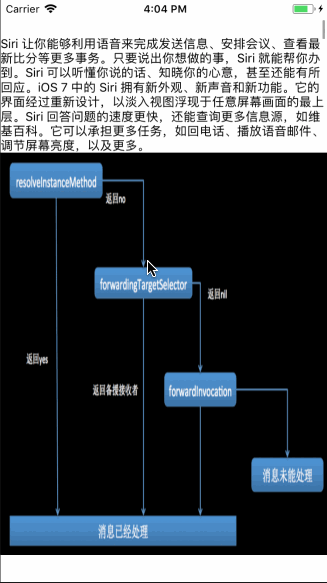

## 如题

>从苹果开发约束,方便了我们快速适配iPhone手机,看到`Masonry`之后,我们就想要适配所有开发中所遇到的问题,今天就适配`Masonry`自适应`tableHeaderView`

## 解答

如果使用frame,计算的话肯定也是可以达到相同结果的,可是`麻烦`,所以今天就使用`Masonry`来完成这个需求

- 首先, 我们一般都是自定义`View`,在这个`View`设置好约束

<!--more-->

**重要**

- 这个自定义`View`,里面的子控件一定要有从`top`到`bottom`连起来的那一条线,就像盖房子一样的,第一个子控件到最后的个子控件,让`tableHeaderView`知道`top`到`bottom`的位置

## 自定义`View`代码

```
// 这个是第一个子控件
[self addSubview:self.oneLabel];
[self.oneLabel mas_makeConstraints:^(MASConstraintMaker *make) {
    make.top.left.right.mas_equalTo(self).offset(0);
}];

// 这个是第二个子控件
[self addSubview:self.oneImageView];
[self.oneImageView mas_makeConstraints:^(MASConstraintMaker *make) {
    make.top.mas_equalTo(self.oneLabel.mas_bottom).offset(0);
    make.left.right.mas_equalTo(self).offset(0);
}];

// 重点,必须设置这个约束,告诉当前view的位置
[self mas_makeConstraints:^(MASConstraintMaker *make) {
    make.bottom.mas_equalTo(self.oneImageView.mas_bottom).offset(0);
}];

```

## `Controller`代码
```
// 必须给headerView设置宽度,不然headView是不知道到底有宽
self.tableView.tableHeaderView = self.headView;
[self.headView mas_makeConstraints:^(MASConstraintMaker *make) {
    make.width.equalTo(self.tableView);
}];
```

## 效果图
