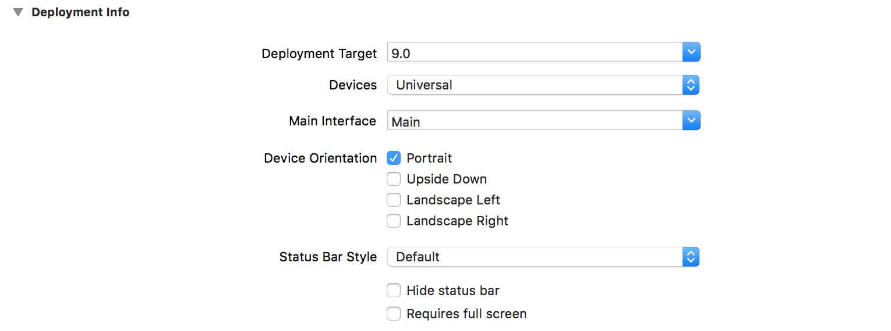
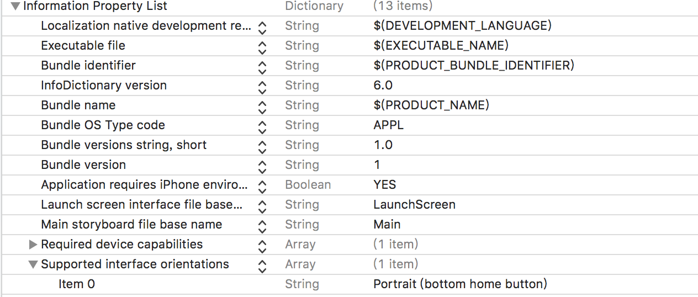

## 问题
>在开发视频播放器的时候,需要视频全屏播放同时还能响应手机旋转

## 所以
>通过资料查找,分为几种方案

**方案一**
>`View`旋转

**方案二**
>转场动画

**方案三**
>强制横竖屏

<!--more-->

## 实践
>今天就考虑直接使用**强制横竖屏**来完成播放器的全屏播放

- General配置


- info.plist配置


>横竖屏跳转的`Controller`

```
- (void)interfaceOrientation:(UIInterfaceOrientation)orientation {
    if ([[UIDevice currentDevice] respondsToSelector:@selector(setOrientation:)]) {
        SEL selector             = NSSelectorFromString(@"setOrientation:");
        NSInvocation *invocation = [NSInvocation invocationWithMethodSignature:[UIDevice instanceMethodSignatureForSelector:selector]];
        [invocation setSelector:selector];
        [invocation setTarget:[UIDevice currentDevice]];
        int val                  = orientation;
        // 从2开始是因为0 1 两个参数已经被selector和target占用
        [invocation setArgument:&val atIndex:2];
        [invocation invoke];
    }
}
```

> 重点,必须配置状态栏才能正确的跳转

```
// 跳转的Controller设置
- (BOOL)shouldAutorotate {
    return NO;
}
```

> 响应事件调用

```
[self interfaceOrientation:UIInterfaceOrientationPortrait];
```

- 一般我们都是`UITabBarController`和`UINavigationController`的结构来完成`App`的框架搭建

> 配置`UITabBarController`

```
- (BOOL)shouldAutorotate{
    return [self.selectedViewController shouldAutorotate];
}
- (UIInterfaceOrientationMask)supportedInterfaceOrientations{
    return [self.selectedViewController supportedInterfaceOrientations];
}
- (UIInterfaceOrientation)preferredInterfaceOrientationForPresentation{
    return [self.selectedViewController preferredInterfaceOrientationForPresentation];
}
```

> 配置`UINavigationController`

```
// viewDidLoad调用
[[UIDevice currentDevice] beginGeneratingDeviceOrientationNotifications];
    
[[NSNotificationCenter defaultCenter] addObserver:self selector:@selector(deviceOrientationDidChange) name:UIDeviceOrientationDidChangeNotification object:nil];

// 方法一获取
- (BOOL)shouldAutorotate{
    return [[self.viewControllers lastObject]shouldAutorotate];
}
- (UIInterfaceOrientationMask)supportedInterfaceOrientations{
    return [[self.viewControllers lastObject]supportedInterfaceOrientations];
}
- (UIInterfaceOrientation)preferredInterfaceOrientationForPresentation{
    return [[self.viewControllers lastObject] preferredInterfaceOrientationForPresentation];
}

// 方法二获取
- (BOOL)shouldAutorotate {
    return [self.topViewController shouldAutorotate];
}

- (UIInterfaceOrientationMask)supportedInterfaceOrientations {
    return [self.topViewController supportedInterfaceOrientations];
}

- (void)deviceOrientationDidChange {
    NSLog(@"NAV deviceOrientationDidChange:%ld",(long)[UIDevice currentDevice].orientation);
    if([UIDevice currentDevice].orientation == UIDeviceOrientationPortrait) {
        [[UIApplication sharedApplication] setStatusBarOrientation:UIInterfaceOrientationPortrait];
        [self orientationChange:NO];
        //注意： UIDeviceOrientationLandscapeLeft 与 UIInterfaceOrientationLandscapeRight
    } else if ([UIDevice currentDevice].orientation == UIDeviceOrientationLandscapeLeft) {
        [[UIApplication sharedApplication] setStatusBarOrientation:UIInterfaceOrientationLandscapeRight];
        [self orientationChange:YES];
    }
}

- (void)orientationChange:(BOOL)landscapeRight {
    CGFloat width = [UIScreen mainScreen].bounds.size.width;
    CGFloat height = [UIScreen mainScreen].bounds.size.height;

    if (landscapeRight) {
        [UIView animateWithDuration:0.2f animations:^{
            self.view.transform = CGAffineTransformMakeRotation(M_PI_2);
            self.view.bounds = CGRectMake(0, 0, width, height);
        }];
    } else {
        [UIView animateWithDuration:0.2f animations:^{
            self.view.transform = CGAffineTransformMakeRotation(0);
            self.view.bounds = CGRectMake(0, 0, width, height);
        }];
    }
}
```

## 最后
>上面全部的代码配置好,iOS强制横屏就已经完成了,大伙自己实践一下!!!
