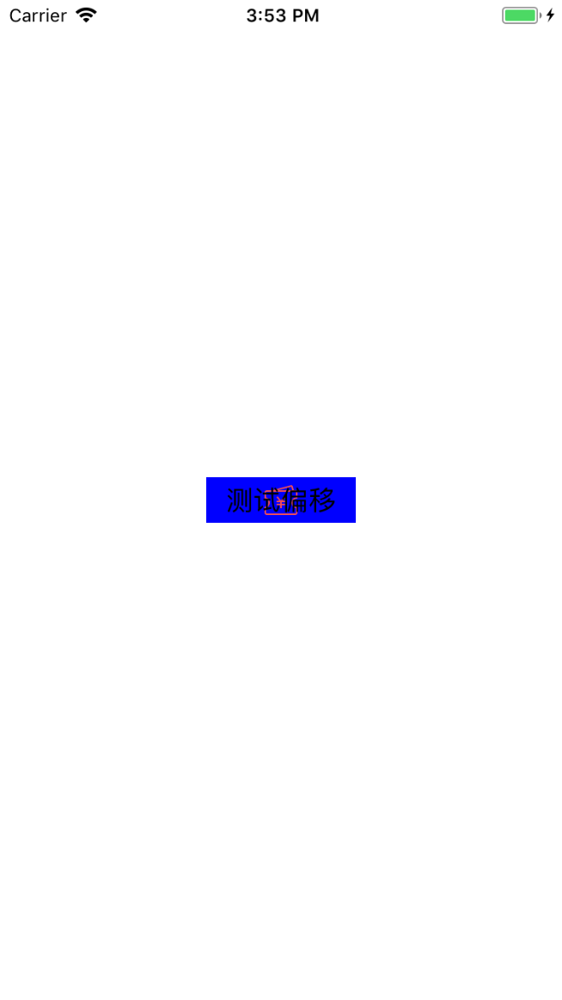
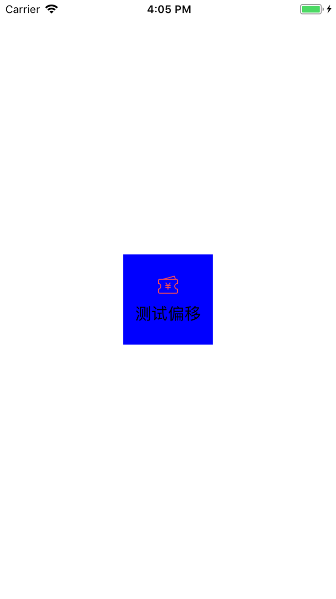
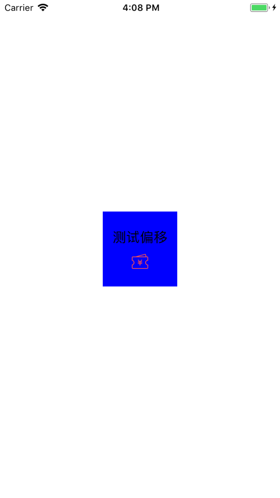
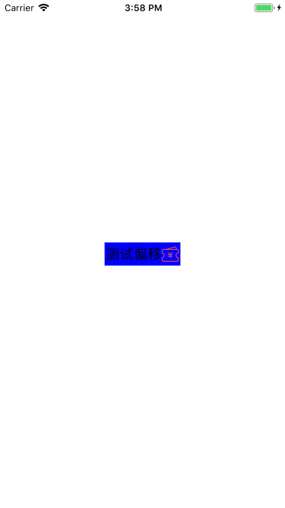

## 理解UIEdgeInsetsMake

>`Creates an edge inset for a button or view.`开发文档中显示

>定义调用方法`UIEdgeInsets UIEdgeInsetsMake(CGFloat top, CGFloat left, CGFloat bottom, CGFloat right)`

```
typedef struct UIEdgeInsets {
    CGFloat top, left, bottom, right;  // specify amount to inset (positive) for each of the edges. values can be negative to 'outset'
} UIEdgeInsets;
```

**简单点说就是对视图的偏移**

## 看黑板,使用说明

1. 定义一个`UIButton`,对它的子视图对它进行布局

2. 按钮`titleLabel`的`titleEdgeInsets`

3. 按钮`imageView`的`imageEdgeInsets`

<!--more-->

```
[btn setTitleEdgeInsets:UIEdgeInsetsMake(0, -btn.imageView.frame.size.width, 0, 0)];
[btn setImageEdgeInsets:UIEdgeInsetsMake(0, 0, 0, -btn.titleLabel.intrinsicContentSize.width)];
```

>**按钮图片文字居中**


### `imageView`在左，`titleLabel`在右 `UIButton`系统默认


### `imageView`在上，`titleLabel`在下 

```
[btn setTitleEdgeInsets:UIEdgeInsetsMake(btn.titleLabel.intrinsicContentSize.height + 10, -btn.imageView.frame.size.width, 0, 0)];
[btn setImageEdgeInsets:UIEdgeInsetsMake(0, 0, btn.imageView.frame.size.height + 10, -btn.titleLabel.intrinsicContentSize.width)];
考虑间隙对图片和文字加了10的偏移量

```
>**按钮图片在上文字在下**


### `imageView`在下，`titleLabel`在上

```
[btn setTitleEdgeInsets:UIEdgeInsetsMake(-btn.titleLabel.intrinsicContentSize.height - 10, -btn.imageView.frame.size.width, 0, 0)];
[btn setImageEdgeInsets:UIEdgeInsetsMake(0, 0, -btn.imageView.frame.size.height - 10, -btn.titleLabel.intrinsicContentSize.width)];

```
>**按钮图片在下文字在上**


### `imageView`在右，`titleLabel`在左

```
[btn setTitleEdgeInsets:UIEdgeInsetsMake(0, -btn.imageView.frame.size.width, 0, btn.imageView.frame.size.width)];
[btn setImageEdgeInsets:UIEdgeInsetsMake(0, btn.titleLabel.intrinsicContentSize.width, 0, -btn.titleLabel.intrinsicContentSize.width)];
```

>**按钮图片在右文字在左**



### `imageView`靠右，`titleLabel`靠左
```
[btn setImageEdgeInsets:UIEdgeInsetsMake(0, btn.frame.size.width - btn.imageView.frame.size.width, 0, -btn.titleLabel.intrinsicContentSize.width)];
[btn setTitleEdgeInsets:UIEdgeInsetsMake(0, -btn.imageView.frame.size.width, 0, btn.frame.size.width - btn.titleLabel.intrinsicContentSize.width)];
```


**`intrinsicContentSize`是iOS 8时候获取的属性**
