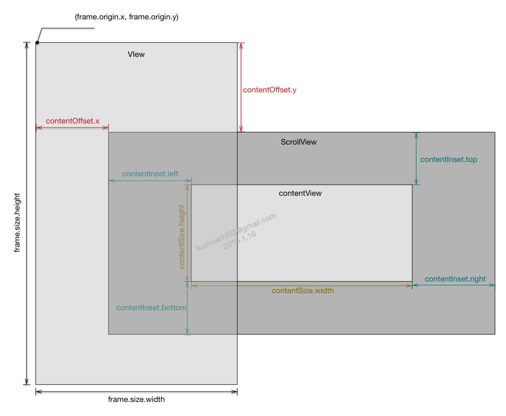

## UIScrollView基础知识

>`UIScrollView`中的`contentSize`,`contentOffset`,`contentInset`的知识点熟悉

### contentSize

>`contentSize`是`UIScrollView`和继承于`UIScrollView`的子控件的属性，`contentSize`是确定`UIScrollView`上`contentView`宽`（contentSize.width）`和高`（conteSize.height）`的属性。

<!--more-->

### contentOffset

>`contentOffset`是`UIScrollView`和继承于`UIScrollView`的子控件的属性，`contentOffset`确定的是`UIScrollView`的顶点（左上角点）值相对于其父类视图的顶点值（即`frame.origin`）的距离

### contentInset 

>`contentInset`是`UIScrollView`和继承于`UIScrollView`的子控件的属性，`contentInset`确定的是`contenView`上下左右相对于`UIScrollView`扩展出来的区域大小。`contentInset`是`UIEdgeInsets`类型的，默认值为`UIEdgeInsetsZero`。

## 布局图

## 理解
>`scrollView.contentInset`默认情况下其初始值都为0；当设置了初始值时（不为零），它相当于给`scrollView`的范围进行了扩大，并加了一堵墙，如果把`scrollView`中的图片理解为一个背景，将`scrollView`理解为一个镜头，通过改变`scrollView.contentOffset`的值就可以改变镜头的初始化位置，但是当你设置了`scrollView.contentInset` 后如果其改变的位置超过了你加的范围它的镜头最多移到你加范围的最大位置

## 参考文档
[熟悉UIScrollView的contentSize,contentOffset,contentInset](https://www.cnblogs.com/Jenaral/p/5540422.html)